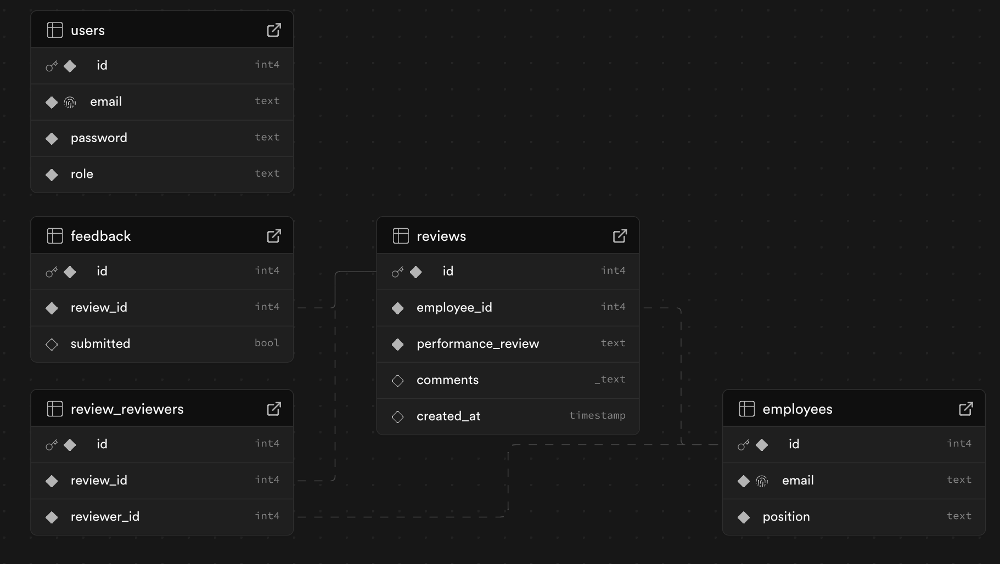

# Employee Review REST API

This project is a Go-based REST API for managing employee reviews, built using the chi router. It provides separate functionality for **admin** and **employee** roles. Admins can manage employees, performance reviews, and assignments, while employees can view and submit feedback for assigned performance reviews.

## Features

### Admin View
Admins can:
- **Manage Employees**:
    - Add new employees.
    - Remove employees.
    - Update employee information.
    - View the list of employees.

- **Manage Performance Reviews**:
    - Add new performance reviews.
    - Update existing performance reviews.
    - View all performance reviews.

- **Assign Participants**:
    - Assign employees to provide feedback for another employee's performance review.

### Employee View
Employees can:
- **View Assigned Performance Reviews**:
    - List performance reviews that require their feedback.

- **Submit Feedback**:
    - Provide feedback for assigned performance reviews.

---

## API Endpoints

### Admin Endpoints

#### Employees Management
- **Add Employee**  
  `POST /admin/employees`  
  Add a new employee.

- **Update Employee**  
  `PUT /admin/employees/{id}`  
  Update an existing employee's information.

- **Remove Employee**  
  `DELETE /admin/employees/{id}`  
  Remove an employee by ID.

- **View Employees**  
  `GET /admin/employees`  
  Retrieve a list of all employees.

#### Performance Reviews Management
- **Add Performance Review**  
  `POST /admin/reviews`  
  Create a new performance review.

- **Update Performance Review**  
  `PUT /admin/reviews/{id}`  
  Update details of an existing performance review.

- **View Performance Reviews**  
  `GET /admin/reviews`  
  Retrieve all performance reviews.

#### Assign Participants
- **Assign Reviewer to Performance Review**  
  `POST /admin/reviews/{review_id}/assign`  
  Assign an employee as a reviewer for a specific performance review.

---

### Employee Endpoints

#### Performance Reviews
- **List Assigned Reviews**  
  `GET /employee/reviews`  
  Retrieve a list of performance reviews assigned to the employee that require feedback.

- **Submit Feedback**  
  `POST /employee/reviews/{review_id}/feedback`  
  Submit feedback for an assigned performance review.
---

---
---
## Requirements

### Prerequisites
- **Go** (version 1.23 or higher recommended)
- **PostgreSQL** as the database backend.

### Dependencies
- [chi](https://github.com/go-chi/chi): For routing and middleware.
- [bcrypt](https://pkg.go.dev/golang.org/x/crypto/bcrypt): For password hashing.
- [jwt-go](https://github.com/dgrijalva/jwt-go): For JSON Web Tokens authentication.

---

## Installation

1. Clone the repository:
   ```bash
   git clone https://github.com/yourusername/employee-review-api.git
   cd employee-review-api
   go run .

## Env variables
   ```bash
   export DATABASE_URL=dbUrl
   ```

## Docs
Can run OpenAPI swagger using `/swagger/index.html`

Generate a new yaml using `swag init`

## Local
To run the API endpoints locally without swagger, you can use tools like Postman or curl. Example requests:

### Login
```bash
 curl -X POST -H "Content-Type: application/json" \
 -d '{"email": "admin@example.com", "password": "admin"}' \
 http://localhost:8080/login
```
    

### Add Employee
```bash
curl -X POST http://localhost:8080/admin/employees \
-H "Authorization: Bearer <your-jwt-token>" \
-H "Content-Type: application/json" \
-d '{"name": "John Doe", "email": "john@example.com"}'

